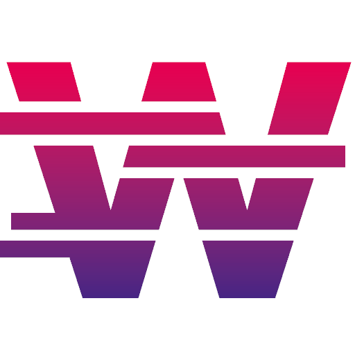

# 🌊🌲🏔 NodeJS Starter Kit

## Stack

## Status

## Links

> General

- [Starter Kits](https://docs.whitten.io/starter-kits)

> GitHub

- [GitHub Workflow](https://docs.github.com/en/actions/using-workflows)

- [Building and Testing NodeJS](https://docs.github.com/en/actions/automating-builds-and-tests/building-and-testing-nodejs#packaging-workflow-data-as-artifacts)

- [Publishing NodeJS packages](https://docs.github.com/en/actions/publishing-packages/publishing-nodejs-packages)
